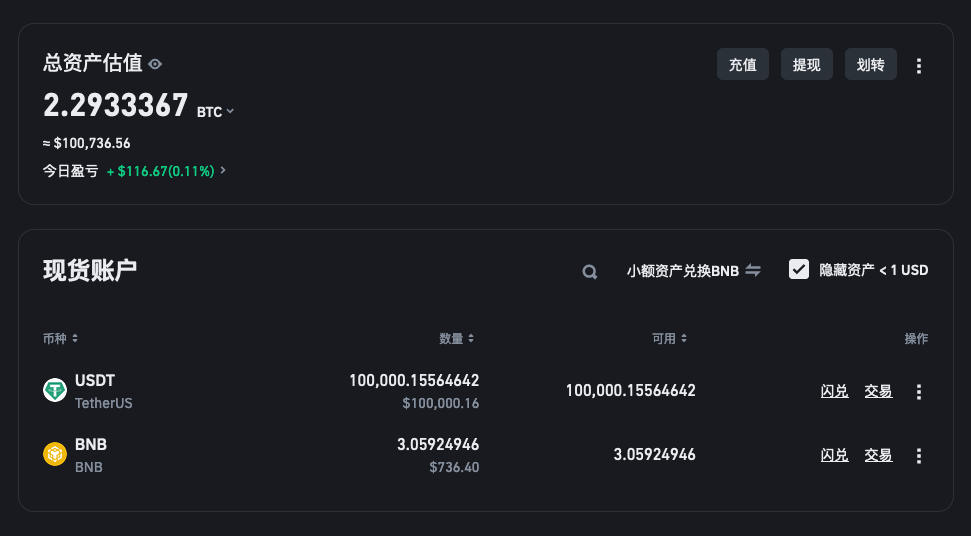
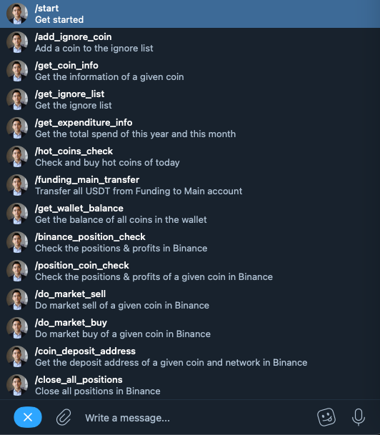

# CRYPTO-TRADING-BOT
An automated trading bot that can also record receipt details into a MySQL database with AI assistance.

The strategy began live testing on June 1, 2023, with a principal of $10,000 USDT. After six months, it achieved a profit of $3,500, which is equivalent to an annualized return of 70%. This performance is partly attributed to the gradual entry into a bull market in the latter half of the year.



Starting from December 10, 2023, this strategy is being open-sourced for the first time, and the principal has been increased to $100,000. Everyone is welcome to observe and study the code.

---

# Preparation:
Ensure Python3 and NPM are installed on your system.
If not, please consult ChatGPT for installation instructions.

Make sure deposit 100,000 USDT into your Binance account. Or any amount of initial fund you prefer.

Reference to my [ChatGPT Conversation](https://chat.openai.com/share/5640285f-4e84-4922-92c6-ed48094c3e74)

# Step 1: Setting Up the Environment
1. Navigate to the root directory:
   ```bash
   cd /root
   ```
2. Clone the Expenditure_bot repository:
   ```bash
   git clone https://github.com/preangelleo/Expenditure_bot.git
   ```
3. Enter the Expenditure_bot directory:
   ```bash
   cd Expenditure_bot
   ```
4. Create a new Conda environment named 'expenditure_ai' with Python 3.9:
   ```bash
   conda create -n expenditure_ai python=3.9
   ```
5. Activate the newly created environment:
   ```bash
   conda activate expenditure_ai
   ```
6. Install required Python packages:
   ```bash
   pip3 install -r requirements.txt
   ```

# Step 2: Database Creation
Install and set up your MySQL database on your Ubuntu server.
Or [Amazon AWS Lightsail](https://lightsail.aws.amazon.com/ls/webapp/home/databases)

How to install or create database? Reference to my [ChatGPT Conversation](https://chat.openai.com/share/2dcc78a6-34b1-4b6b-938e-9d630cf57a86)

# Step 3: Configuration
1. Copy the .env.template file to create a new .env file:
   ```bash
   cp .env.template .env
   ```
2. Open the .env file with nano for editing:
   ```bash
   nano .env
   ```
   - Enter your credentials in the .env file. Make sure the Initial fund amount is less or equal to the USDT balance of your Binance.
   - Alternatively, copy the content of .env.template to a text editor, complete your personal credentials, and then paste it back into the .env file on your server.

# Step 4: Database and Table Creation
1. In the Expenditure_bot folder, run the script to create the database and tables:
   ```bash
   python3 Database_create.py
   ```
2. Wait for the confirmation message: "All tables created successfully!"

# Step 5: Launch the Bot
Start the bot using the following command:
   ```bash
   python3 Telegram_bot.py
   ```

# Step 6: Ensure Continuous Bot Operation
1. Use NPM to keep the bot running:
   ```bash
   pm2 start Telegram_bot.py --name ep --interpreter python3
   ```
2. To restart the bot, use:
   ```bash
   pm2 start ep
   ```

# Step 7: Setting Up Crontab Automation
1. Copy the content from `crontab_template.txt`.
2. On your Ubuntu Server Terminal, open the crontab editor:
   ```bash
   crontab -e
   ```
3. Paste the copied content into the editor.
4. To save and exit, press `Ctrl + X`, then press `Y` and `Enter` to confirm the crontab jobs.

Now, everything is set up and ready to go!

---

# MENU OF TELEGRAM BOT

<div align="center">
  
</div>

---

# About the auto-trading strategy:

### 1. Token Market Cap and Circulating Ratio Calculation
- The function `get_token_market_cap_and_ratio` retrieves market data for a specific cryptocurrency token.
- It calculates the market cap, fully diluted market cap, and the circulating ratio of the token.
- The circulating ratio is determined by dividing the market cap by the fully diluted market cap.
- The function also calculates the turnover ratio of the token and compares it to Ethereum's turnover ratio.

### 2. Selection of Hot Coins from Binance
- `binance_today_hot_coin` function selects potential investment coins based on recent trading data from Binance.
- It filters coins based on criteria like price change percentage, last price, and trading volume.
- Coins are excluded if they fall outside specific price ranges or are part of an ignore list.
- The function further filters coins by market cap, ensuring they fall within a specified range.

### 3. Data Storage and Retrieval
- The selected coins are stored in a database with their market cap and other relevant data.
- The database also maintains a record of the latest updates and transactions.

### 4. Checking and Managing Positions
- `binance_today_hot_coins_check` function manages your trading positions.
- It checks for open positions and the number of coins you currently hold.
- If you have reached your limit of positions, no further action is taken.
- The function also verifies if the selected hot coins are already in your positions and skips them if they are.

### 5. Coin Purchase Execution
- For each selected coin not already in your positions, the system checks its information from CoinMarketCap.
- If the coin meets the criteria, it proceeds to execute a market buy order for one unit of the coin.

### 6. Notification and Error Handling
- The system sends notifications about the status of the trades and actions taken.
- It handles exceptions and errors, providing feedback on failed transactions.

### Summary
The core underlying logic of this strategy is to "be bullish on cryptocurrencies." Therefore, if cryptocurrencies weaken in the long term, this strategy is certain to lose money.

The goal of this strategy is to outperform BTC. If BTC increases tenfold in ten years, the target for this strategy is to exceed a tenfold return.

The trading logic of this strategy is to follow the trend and take profits at a 5% gain, repeating this process. There is no restriction on the trading currency; selections are made based on the list of currencies with the highest increases. However, there is an Ignore List, similar to a blacklist, which can be updated at any time through a Telegram Bot.

The main parameters for selecting currencies in this trading strategy are: a daily trading volume of more than $50 million, a trading volume/market capitalization (Turnover Rate) higher than ETH, a market capitalization of over $100 million, a total circulating market capitalization of less than $10 billion, and a coin price greater than $0.001 but less than $1000.

The default limit for holdings in this trading bot is set to 10 positions. Once fully invested, no further purchases are made until a coin is sold for a profit, freeing up a position.

This trading strategy does not set a stop-loss policy. If all 10 positions are filled and all are losing, the strategy essentially waits indefinitely.

---

